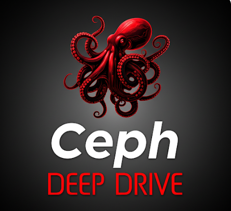

 

#### English | [简体中文](README_cn.md)

  <a href="https://github.com/opencurve/curve/tree/master/docs">
    

## 📖 Featured Articles

### 🔍 Ceph Beginner’s Guide

* [Beginner’s Guides](https://docs.ceph.com/en/latest/start/beginners-guide/)

* [IBM Storage Ceph for Beginners](https://community.ibm.com/community/user/viewdocument/ibm-storage-ceph-for-beginners?CommunityKey=1142f81e-95e4-4381-95d0-7977f20d53fa&tab=librarydocuments)

### 🏗️ [Architecture Analysis](https://github.com/wuhongsong/ceph-deep-dive/tree/main/Architecture-Analysis)

- [CephFS-MDS System Architecture Overview](https://github.com/wuhongsong/ceph-deep-dive/blob/main/Architecture-Analysis/en/CephFS-MDS%20System%20Architecture%20Overview.md)
- [OSD System Architecture Overview](https://github.com/wuhongsong/ceph-deep-dive/blob/main/Architecture-Analysis/en/OSD.md)
- [Mon System Architecture Overview](https://github.com/wuhongsong/ceph-deep-dive/blob/main/Architecture-Analysis/en/Ceph%20Mon%20System%20Architecture%20Overview.md)
- [Manager Module Designand Operation](https://static.sched.com/hosted_files/ceph2024/76/Cephalocon2024_Ceph_Manager.pdf?_gl=1*qg83b5*_gcl_au*MTk4MTIxMDc0NS4xNzI5NTYzMDEw*FPAU*MTk4MTIxMDc0NS4xNzI5NTYzMDEw)
- [Ceph-CSI:Bridging Containers and Ceph](https://static.sched.com/hosted_files/ceph2023/ef/CephCSI.pdf?_gl=1*13j926j*_gcl_au*MzQxODQ2MzMzLjE3NDcyOTEyMjg.*FPAU*MzQxODQ2MzMzLjE3NDcyOTEyMjg)

*  others, add later, Your contributions are warmly welcome

  
### 🛠️ [Practice, application](https://github.com/wuhongsong/ceph-deep-dive/tree/main/Application-Practice)

####  💡 Who Are Use Ceph

- [Cern](https://indico.cern.ch/event/1457076/attachments/2934445/5156641/Ceph,%20Storage%20for%20CERN%20Cloud.pdf)
- [DigitalOcean](https://ceph.io/assets/pdfs/events/2024/ceph-days-nyc/2024%20Ceph%20Day%20NYC%20How%20we%20Operate%20Ceph%20at%20Scale.pdf)
- [45Drives](https://ceph.io/assets/pdfs/events/2024/ceph-days-nyc/45Drives%20-Ceph%20Days%202024%20-%20FINAL.pdf)
- [Bloomberg](https://static.sched.com/hosted_files/ceph2023/2e/Cephalocon%202023%20-%20multisite.pdf?_gl=1*4b8rzs*_gcl_au*MTk4MTIxMDc0NS4xNzI5NTYzMDEw*FPAU*MTk4MTIxMDc0NS4xNzI5NTYzMDEw)
- [sony](https://static.sched.com/hosted_files/ceph2024/9f/Cephalocon2024-Ceph_as_a_platform.pdf?_gl=1*4dvljn*_gcl_au*MTk4MTIxMDc0NS4xNzI5NTYzMDEw*FPAU*MTk4MTIxMDc0NS4xNzI5NTYzMDEw)
- [walmart](https://ceph.io/assets/pdfs/events/2025/ceph-days-silicon-valley/05%20-%20Pavan%20Anton%20-%20Walmart%20Ceph%20Days%202025%20Presentation.pdf)
- [etraveli group](https://static.sched.com/hosted_files/ceph2024/0a/Etraveli%20Group%20Presentation%20_%20Cephalocon2024.pdf)
- [UKRI](https://ceph.io/assets/pdfs/events/2025/ceph-day-london/07%20LT%20Learning%20opportunities%20from%20a%20100PB%20Ceph.pdf)
- [proton](https://static.sched.com/hosted_files/ceph2024/10/proton_jan_luis.pdf)
- [Nordic AB: Ceph(FS) Operations Retrospective](https://static.sched.com/hosted_files/ceph2024/b4/Cephalocon2024_CephFS_Operations_Retrospective.pdf)

- others, add later, Your contributions are warmly welcome

####  🛠️ performance tune

* [Ceph Tentacle Erasure Coding Enhancements](https://github.com/wuhongsong/ceph-deep-dive/blob/main/Distributed-Storage/en/Ceph%20Tentacle%20Erasure%20Coding%20Enhancements.md)
* [Ceph: A Journey to 1 TiB/s](https://ceph.io/en/news/blog/2024/ceph-a-journey-to-1tibps/)

* [performance tuning of ceph rbd](https://www.intel.com/content/www/us/en/developer/articles/technical/performance-tuning-of-ceph-rbd.html)

* [Designing and Tuning for All-Flash Ceph RBD Storage](Application-Practice/en/Ceph-Days-NYC-2024-Designing-and-Tuning-for-All-Flash-Ceph-RBD-Storage.pdf)
  
#### 🛠️ [Operation and maintenance skills](https://github.com/wuhongsong/ceph-deep-dive/tree/main/Operation-Skills)

- [useful scripts from 45drives](https://scripts.45drives.com/)

- [useful scripts from Cern](https://gitlab.cern.ch/ceph/ceph-scripts)

- [Practical Guide: A Summary of Commonly Used Tools in Ceph](https://github.com/wuhongsong/ceph-deep-dive/tree/main/Operation-Skills)

####  💡 Ceph Practice Online

**more see above link**

### 🔍 [Source Code Analysis](https://github.com/wuhongsong/ceph-deep-dive/tree/main/Code-Analysis)

* [BlueStore](https://github.com/wuhongsong/ceph-deep-dive/tree/main/Code-Analysis)

🤝 others, add later, Your contributions are warmly welcome.

* [CephFS-Kclient](https://github.com/wuhongsong/ceph-deep-dive/tree/main/Code-Analysis)
* [CephFS-MDS](https://github.com/wuhongsong/ceph-deep-dive/tree/main/Code-Analysis)
* [OSD](https://github.com/wuhongsong/ceph-deep-dive/tree/main/Code-Analysis)
* [Mon](https://github.com/wuhongsong/ceph-deep-dive/tree/main/Code-Analysis)
* [Mgr](https://github.com/wuhongsong/ceph-deep-dive/tree/main/Code-Analysis)

### 📖 [Resesrch For Ceph(papers & presentations)](https://github.com/wuhongsong/ceph-deep-dive/issues/7)

- [File systems unfit as distributed storage backends: lessons from 10 years of Ceph evolution](https://dl.acm.org/doi/pdf/10.1145/3341301.3359656)
- [Ceph: A Journey to 1 TiB/s](https://ceph.io/en/news/blog/2024/ceph-a-journey-to-1tibps/)
- [IBM Storage Ceph](https://www.ibm.com/docs/en/storage-ceph/8.0.0)

**more see above link**

  
### 📖 [Distributed-Storage Research](https://github.com/wuhongsong/ceph-deep-dive/tree/main/Distributed-Storage)

* [From.deepseek-3FS.to.AI.Storage](https://github.com/wuhongsong/Ceph-Learn-Notes/blob/main/Distributed-Storage/en/From.deepseek-3FS.to.AI.Storage.md)
* [linux kernel docs](https://lwn.net/Kernel/Index/)
* [DAOS File System: Phoenix Rising After Optane's End.md](https://github.com/wuhongsong/ceph-deep-dive/blob/main/Distributed-Storage/en/DAOS%20File%20System:%20Phoenix%20Rising%20After%20Optane's%20End.md)

* Ceph vs. JuiceFS vs. Alluxio vs. CubeFS vs Daos vs. ?

**more see above link**

## 🤝 Contributing

We warmly welcome community contributions! Whether it's:

[How To Contribute](https://github.com/wuhongsong/ceph-deep-dive/blob/main/CONTRIBUTING.md)

## 📞 Contact

- **Issue Discussions**: [GitHub Issues](https://github.com/wuhongsong/ceph-deep-dive/issues)
- **Email Contact**: wojiaowugen@163.com
- **Wechat**: wojiaowugen

-----
<!-- Copy-paste in your Readme.md file -->

<a href="https://next.ossinsight.io/widgets/official/analyze-repo-stars-map?repo_id=991781952&activity=stars" target="_blank" style="display: block" align="center">
  <picture>
    <source media="(prefers-color-scheme: dark)" srcset="https://next.ossinsight.io/widgets/official/analyze-repo-stars-map/thumbnail.png?repo_id=991781952&activity=stars&image_size=auto&color_scheme=dark" width="721" height="auto">
    
  </picture>
</a>

<!-- Made with [OSS Insight](https://ossinsight.io/) -->
